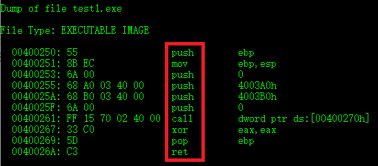
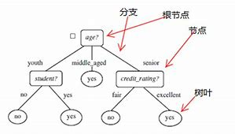
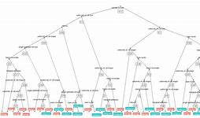
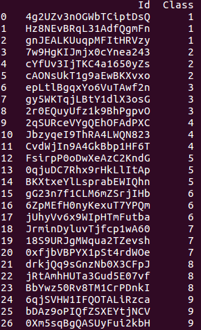
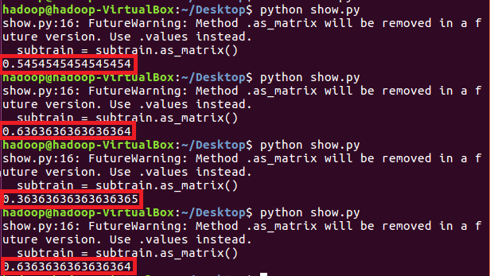

# 机器学习检测恶意代码

## 一、总览
* 使用机器学习方法，检测恶意代码，但不能够进行查杀。
* 使用纯静态分析，不涉及行为分析等的动态分析方法。
* 使用的数据是微软提供的利用IDA反汇编工具生成的`.asm`文件和数据集。由于数据集过于大，便只抽取了小部分进行分析。
* [数据集的下载](https://www.kaggle.com/c/malware-classification/data)。
* 使用到了：恶意代码图像，`n-gram`，机器学习的决策树与随机森林算法等技术手段。
* 完成了windows平台上的恶意代码检测。
### 1. 背景
* 大约在80年代的末期，随着恶意代码的诞生，反恶意代码软件也随之诞生。这个时期的恶意代码所采用的方法技术都比较简单，这也使得相应的检测技术也比较简单。早期的反病毒软件大多以单一的特征匹配为主要方法，利用特征串就可简易地对软件进行检测。
* 但随着恶意代码技术的发展，恶意代码也开始在传播过程中可以进行变形来躲避查杀软件的查杀，这就意味着作为同一个恶意代码为根源的变种数量大大增加，最终呈现的形态与根源代码相比也发生了较大的变化，此时反病毒软件也很难提取出一段代码作为该类恶意代码的特征码。因此，广谱特征码随之诞生。广谱特征码将特征码进行了分段，通过掩码字节对需要进行比较的和不需要进行比较的区段进行了细致划分。但是无论是特征码扫描还是广谱特征，都是需要获得恶意代码样本后，再进行特征的提取，随后才能进行恶意代码的检测。这使得对恶意代码的查杀总是有一定的滞后性：总是先得到恶意代码，再进行检测。
* 启发式扫描就是为了针对这种变种病毒和未知病毒而诞生的。启发式扫描利用已建立的对恶意代码的检测、经验和知识，对未知的二进制代码进行检测。这种技术也就是利用机器学习，使得软件有自己对未知代码的判断。这种技术的起源，来于恶意代码具有普通二进制文件所不具有的恶意行为，例如非常规读写文件，终结自身进程，非常规切入零环等等。
### 2. 恶意代码图像
* 恶意代码图像最早是由加利福尼亚大学的`Nataraj`和`Karthikeyan`于2011年在论文`Malware Images: Visualization and Automatic Classification`中提出的。具体思路是这样的：把一个二进制文件用灰度图展现出来，利用图像中的纹理特征对恶意代码进行聚类分析。但这种思路还有待改进与探索。
* 本次实验中对于`.asm`文件尝试提取了文件图像纹理特征。

### 3. `n-gram`
* `n-gram`是自然语言处理领域的概念，早起的语音识别技术与统计语言模型就是使用的`n-gram`。
* `n-gram`基于一个假设，认为一个词出现的概率仅仅与它之前的`n-1`个词有关，而这个概率可以从大量的资料中进行统计进而得到。从而我们可以看出`n-gram`其实在一定程度上包含了部分的语言特征。
* 将`n-gram`这一概念应用到恶意代码识别的想法最早由`Tony`等在2004年的论文`N-gram-based Detection of New Malicious Code`中提出，不过当时他们的想法是基于`ByteCode`的。`Moskovitch`等在2008年的论文`Unknown Malcode Detection Using OPCODE Representation`中提出，使用`OpCode`代替`ByteCode`。
* `n-grams`模型是使用`n-grams`的统计特性来模拟序列。示意图如下：



```
OpCode 1-gram push,mov,push,push,push,push,call,xor,pop,ret
OpCode 2-gram push mov,mov push,push push,push push,...
OpCode 3-gram push mov push,mov push push, push push push,...
```

### 4. 决策树
* 决策树是在已知各种情况发生概率的基础上，直观运用概率分析的一种图解法。



* 在机器学习中，决策树是一个预测模型，他代表的是对象属性与对象值之间的一种映射关系。决策树是一种树形结构，其中每个内部节点表示一个属性上的测试，每个分支代表一个测试输出，每个叶节点代表一种类别。
* 因此，决策树是一种十分常用的分类方法。他是一种监管学习，所谓监管学习就是给定一堆样本，每个样本都有一组属性和一个类别，这些类别是事先确定的，那么通过学习得到一个分类器，这个分类器能够对新出现的对象给出正确的分类。这样的机器学习就被称之为监督学习。

### 5. 随机森林
* 随机森林指的是利用多棵决策树对样本进行训练并预测的一种分类器。它是一种非常强大的机器学习方法，以随机的方法建立一个由多棵决策树组成的森林，该森林中每一棵决策树之间是没有关联的。当有一个新的输入样本输入到随机森林时，森林中每一棵决策树都对该样本进行一次判断，预测出这个样本应该属于哪一类的，被选择次数最多的类型，就是该样本被该随机森林预测为的类型。



* 随机森林的精髓在于：有多个决策树对同一件事情进行判断且互不受各方影响。最终所得出的结论也是多个决策树一同判定所得出的结论，是一种“集体智慧”的体现，进而可以变成一个“强分类器”。

## 二、windows平台上的实验
### 1. 数据集与环境的说明
* 由于电脑内存有限，故不能跑大量的数据，只从微软提供的数据集（压缩包17.5G）中抽取了27个文件进行运行。这27个文件的抽取也是手动从压缩包里复制粘贴出来的。27个文件囊括：9个分类，每个分类3个文件。下图是抽取的文件目录。实验选取了`.asm`格式的文件。



* 环境使用了`python`，需要安装的库有：`sklearn`、`pandas`、`numpy`、`scripts`等。

* 仓库中的`win数据集.zip`中放有：
```bash
subtrainLabels.csv：子数据集标签文档。
resource文件夹：放有根据子数据集标签文档中提出的asm文件。
imgfeature：生成的asm文件图像纹理特征文件。
3gramfeature：生成的Opcode的n-gram特征文件。
```

### 2. 提取asm文件图像纹理特征
* 现将二进制文件转为十六进制文件，再按字节分割，根据设定的宽度生成矩阵，进而使用像素点进行填充。
```bash
binascii.hexlify(data)：用于将二进制数据转换为十六进制。
numpy.array()：用于生成矩阵。
numpy.reshape()：根据设定好的宽度重新生成矩阵，
numpy.uint8()：添加像素点。
Image.fromarray()：转换为图像。
list.extend(seq)：用于在列表末尾一次性追加另一个序列中的多个值，用新列表扩展原来的列表。
dict.defaultdict()：用于设置字典的默认值。
pandas.read_csv()：将逗号分隔值（csv）文件读入DataFrame。
```

[asm.py](asm.py)

### 3. 提取Opcode的n-gram特征
* 通过从asm文件中获得Opcode序列，再之后进行训练，最后根据Opcode序列，得到最终统计对应的n-grams。本次实验生成的n-grams参数为3。
```bash
getOpcodeSequence(filename)：获取asm文件的Opcode序列。
train_opcode_lm()：进行训练。
getOpcodeNgram()：根据Opcode序列，统计对应的n-gram。
```

[ngram.py](ngram.py)

### 4. 基于asm文件图像纹理特征与Opcode的n-gram特征的随机森林
* 这一步引用了python自带的机器学习库`sklearn`。可直接使用。安装过程需要升级`pip`，再次安装即可。使用的`cross_validate.train_test_split`函数也需更改为`train_test_split`。
```bash
subtrainfeature1：用于生成Opcode的n-gram特征随机森林。
subtrainfeature2：用于生成asm文件图像纹理特征随机森林。
pandas.merge()：将上面两个函数生成的特征进行了合并。统一结果。
```

[show.py](show.py)

### 5. 实验结果展示
* 由于样本太少，生成的误差较大。想要获取更精准的结果，需要大量的样本进行操作。




## 参考资料
1. [利用机器学习进行恶意代码分类](http://drops.xmd5.com/static/drops/tips-8151.html)
