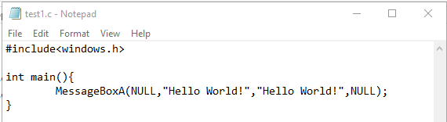
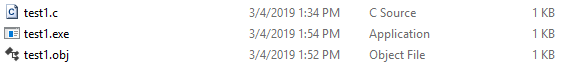

# 软件与系统安全 第一题

## 1.代码

## 2.命令行编译。

其中”/nologo”表示不显示程序的版本信息。 “/c”表示在一个文件的情况下，只编译不链接。

## 3.编译结果展示。

该文件夹里出现同名obj文件。

## 4.命令行链接。

其中”/ENTRY:main”表示从main函数开始，这是因为初始化的时候，在真正运行main之前加了一大段代码，同时后面也添加了代码。”/NODEFAULTLIB”表示不加默认库。”/SUBSYSTEM:WINDOWS”表示运行系统是Windows，本身系统为Windows时，可以不添加。”ALIGN:16”表示对齐参数为16。”user32.lib”添加的目的是解决源代码中的MessageBoxA函数没有进行定义，出现“未解决的外部符号”错误。

## 5.链接结果展示。

该文件夹里出现同名exe文件。该exe文件大小为976B。

## 6.运行结果展示。

这里需要注意的是，运行过程中会出现正常操作不能结束进程的错误。此时需要任务管理器中关掉或者源代码中添加ExitProcess函数，同时链接操作中相应地添加kernel32.lib。

## 7.在二进制编辑器中打开exe文件，找到”Hello World”字样，并改为”Hello CUC”。保存。

## 8.重新运行exe文件。

