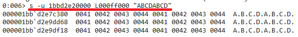

# 软件与系统安全
## 题目3：在notepad（32位64位均可）中，输入一段文字。然后使用调试器，在内存中修改这段文字。使得没有在界面操作notepad的修改文字的情况下。notepad中显示的文字变化。

* 提示，在调试器中定位控件缓存的内存地址，可以用搜索、逆向、消息截获分析、API截获分析等方法。

### 实验3基本原理

* 记事本打开，写一段文字。这段文字本身不在程序文件中，就属于外部输入数据。
* 代码和数据。
* 三四题同样都是在运行时，程序已经在内存中，动态分配内存空间，把输入数据存起来，再通过控件显示（textout函数，字符串转换为像素块矩阵再显示在显存中）。
* 在内存当中找到输入的数据。搜索就行。如何在内存中搜索，用到了公式调试器，推荐windug。olldgb也行。找到数据并修改。

### 实验3具体过程
* 原理：通过windbg直接修改程序内存。找到存放字符串的内存地址，对它进行修改，再继续执行该进程。

#### 步骤一
* 先使用记事本新建一个文件```1.txt```，其中输入字符串```ABCDABCD```。

* 打开windbg，从文件中找到```Attach to process```，再从文件中找到```notepad.exe```。


#### 步骤二
通过查看堆，找到字符串，显示Unicode。

```
#查看堆：
!heap -a
```


```
#查看字符串：
s -u 1bbd2e20000 L000ff000 "ABCDABCD"
```



```
#显示为Unicode：
du 000001bb`d2e7c3800
```


#### 步骤三 
修改内存中的数据，并继续运行进程。

```
#修改字符串
ezu 000001bb`d2e7c380 "AAAAAAAA"

#显示Unicode
du 000001bb`d2e7c380

#继续运行程序
g
```


#### 结果显示
此时记事本闪了一下，并显示为“AAAAAAAA”。
将记事本重新启动，仍显示为“ABCDABCD”。


