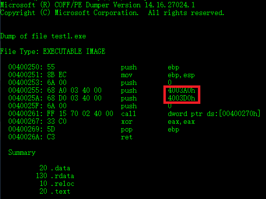
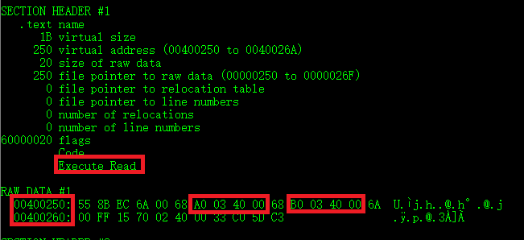
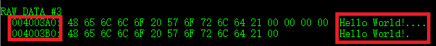
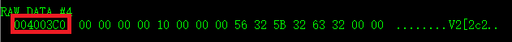
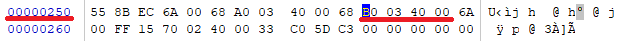
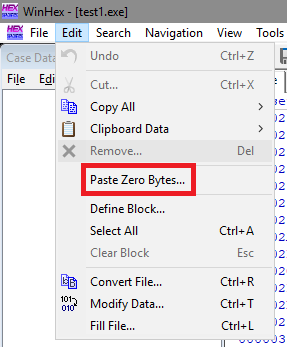
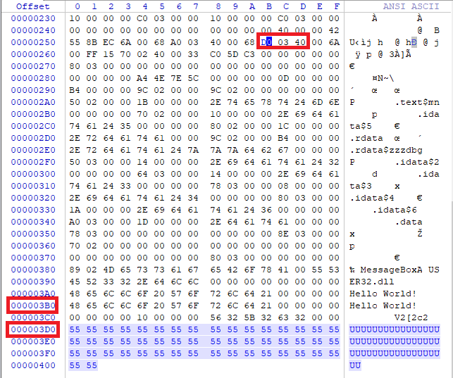
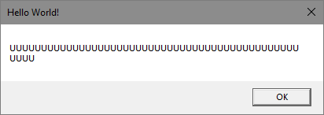

# 题目二

## 题目内容

* 在上一题基础上，修改显示内容变为一个很长的字符串（至少2kb长）。并且保证程序正常运行不崩溃。

## 程序内容

```bash
#include<windows.h>

int main()
{
	MessageBoxA(NULL,"Hello World!","Hello World!",NULL);
}
```
> 与第一题是一样的。

## 实验过程
* 编译链接与第一题步骤也一致。故第二题直接使用了第一题的exe文件。

* 使用vs Developer Command Prompt。

```bash
# 进入当前目录
cd 目录的绝对地址
# 显示反汇编信息
dumpbin /disasm test1.exe
# 显示除代码反汇编外的所有可用信息
dumpbin /all test1.exe
```





> 看到代码段的起始位置为：400250。
> 两个参数的地址分别为：4003A0和4003B0。

* 查看4003A0和4003B0的地址。



> 可以看到4003A0地址为messagebox标题参数的地址。所以要修改显示内容就为4003B0地址的内容。

* 查看代码段结束地址。



* 打开winhex软件，导入test1.exe。



> 找到代码段的起始地址。

* 在代码末尾位置添加新的字符串
此处使用了winhex自带的```paste zero bytes```功能。



> 此时需要注意光标需放在要添加零的位置。
> 然后将零修改为需要的字符。
> 此处没有添加很多零，只是一部分。很长的字符串同理。

* 修改地址。



> 从原来指向03B0的内容```Hello World!```修改为指向03D0的内容长字符串。

* 运行exe文件。




