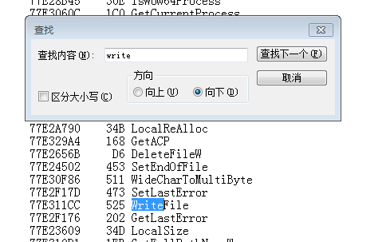

# 实验题目
* 5、通过`API hook`的方法，在每次`notepad`保存`txt`文件时，就将文件内容修改为：`you have been hacked!`

# 实验思路
* 由第五题第一部分与第二部分的知识可以完成本实验。

* 通过远程注入的方式在受害者进程（本题为`notepad.exe`）中执行`IATHook`。

* 可修改前两个部分的代码完成。

* 但是需要知道`notepad.exe`在保存文件的时候会调用什么`API`函数，于是通过导入表，进行合理猜测。

# 实验步骤
* 查看32位`notepad.exe`的导入表
```bash
# 查看notepad的导入表,并输出到notepad_imp.txt中
# Developer Command Prompt for VS 2019
cd C:\Windows\SysWOW64
dumpbin /imports notepad.exe >C:\Desktop\notepad_imp.txt
```

* 在导入表中查看关键字：`save`、`file`、`write`等。
注：也可使用`grep`命令:`cat notepad_imp.txt | grep -i 关键字`





> 由于save关键字只有一个函数匹配，而很明显从名字上就可以知道与保存文件名字有关的。

> file关键字有太多的匹配项，故也舍去。

> 同样，write关键字也只有一个函数匹配。通过MSDN搜索原函数，发现就是这个writefile函数起到关键性作用。

> 同时在msdn网站上也得到了函数原型。

* 生成`HookWritefile.dll`。
    * 与第一部分过程基本一致新建一个windows桌面向导文件。注意选择`dll`文件。
    * 注意需要更改`项目`-`属性`的字符集为`使用多字节字符集`。
    * 该项目中应当存在两个文件：[HookWritefile.cpp](HookWritefile.cpp)以及[IAThook.cpp](IAThook.cpp)。
    * 仅生成即可，将生成的[HookWritefile.dll](HookWritefile.dll)放入一个便于找到的路径。
    
* 生成`InjectNotepad.cpp`文件。
    * 同样与第一部分过程基本一致新建一个windows桌面向导文件。注意选择`exe`文件。
    * 注意需要更改`项目`-`属性`的字符集为`使用多字节字符集`。
    * 该项目中存在一个文件：[InjectNotepad.cpp](InjectNotepad.cpp)。

* 实验运行
    * 首先打开`notepad.exe`，然后写入数据。注意此时不保存。
    * 运行`InjectNotepad`项目，得到反馈：`远程线程执行完毕`，即完成注入过程。
    * 关闭`InjectNotepad.cpp`，提示进行保存。再次打开可以看到已经完成了实验要求：显示为：`you have been hacked!`。

* 实验录屏


# 问题
一开始项目运行总是不对，显示`远程线程创建失败`。后发现错误：直接从程序中找到的`notepad.exe`，这个`exe`文件不是32位的，需要从`C:\Windows\SysWOW64`文件下找到32位的`notepad.exe`进行实验。

# 参考资料
[msdn-writefile](https://docs.microsoft.com/en-us/windows/desktop/api/fileapi/nf-fileapi-writefile)
