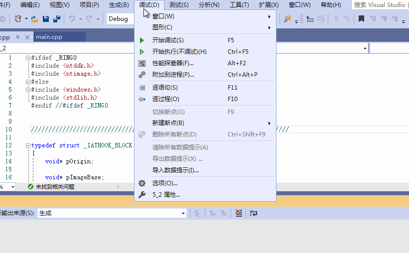

# 第五题第二部分：IAT hook

* 此部分为第二部分。IAT hook过程。

# 具体说明：
* `IAT`，`import address table`，导入地址表。
    * 导入函数就是被程序调用但他们的执行代码又不在程序中的一些函数，这些函数的代码位于一个或者多个`DLL`中。
    * 当`PE`文件被装入内存的时候，`Windows`装载器才将`DLL`装入，并将调用导入函数的指令和函数实际所处的地址联系起来(动态连接)，这操作就需要导入表完成。
    * 其中导入地址表就指示函数实际地址。
* `IAT hook`：
    * 通过`IAT hook`，可以改变一个系统`api`的原有功能。基本的方法就是通过`hook`“接触”到需要修改的`api`函数入口点，改变它的地址指向新的自定义的函数。
    * 原理是`PE`文件里有个导入表，代表该模块调用了哪些外部`API`，模块被加载到内存后，`PE`加载器会修改该表，地址改成外部`API`重定位后的真实地址，我们只要直接把里面的地址改成我们新函数的地址， 就可以完成对相应操作。

* 代码 ：
    * 本次实验使用了两个源文件。[IAT.cpp](IAT.cpp)和[main.cpp](main.cpp)。
    * 实验使用的两个源文件是由 `Github`网站上找到的。参考链接于文末已给出。
    * `IAT.cpp`是`IAT hook`的具体实现。
    * `main.cpp`是一个使用实例。可以跳出两个`messagebox`。

# 具体步骤：
* 参照第五题第一部分新建一个exe工程。
* 添加源文件`IAT.cpp`和`main.cpp`。
* 编译执行

# 实验结果展示：

[mp4格式](5-2录屏.mp4)

## 参考资料

[Github：tinysec/iathook](https://github.com/tinysec/iathook)

[IAT HOOK](https://blog.csdn.net/enjoy5512/article/details/51570116)