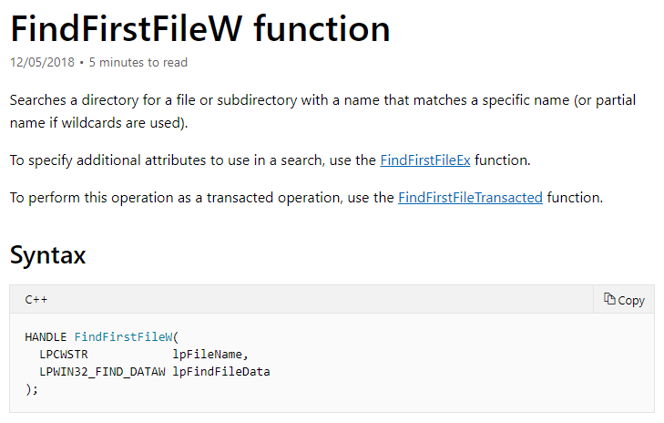
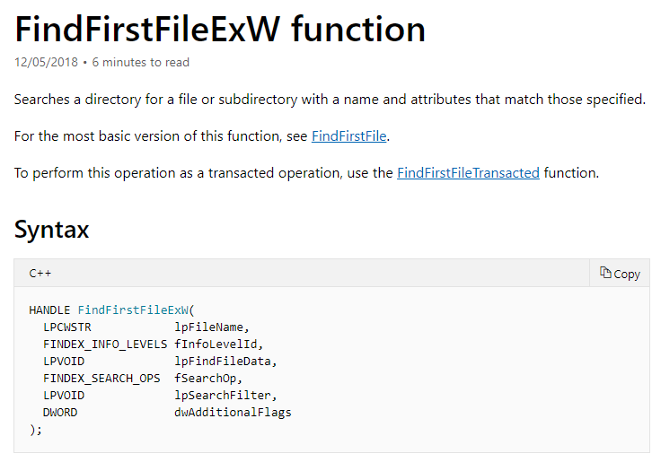
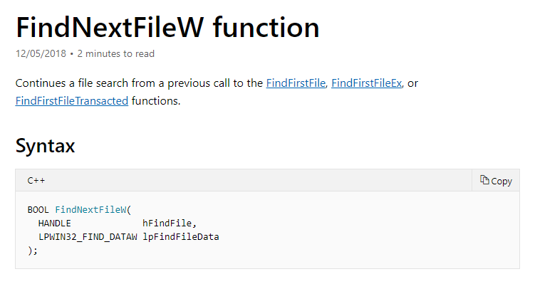
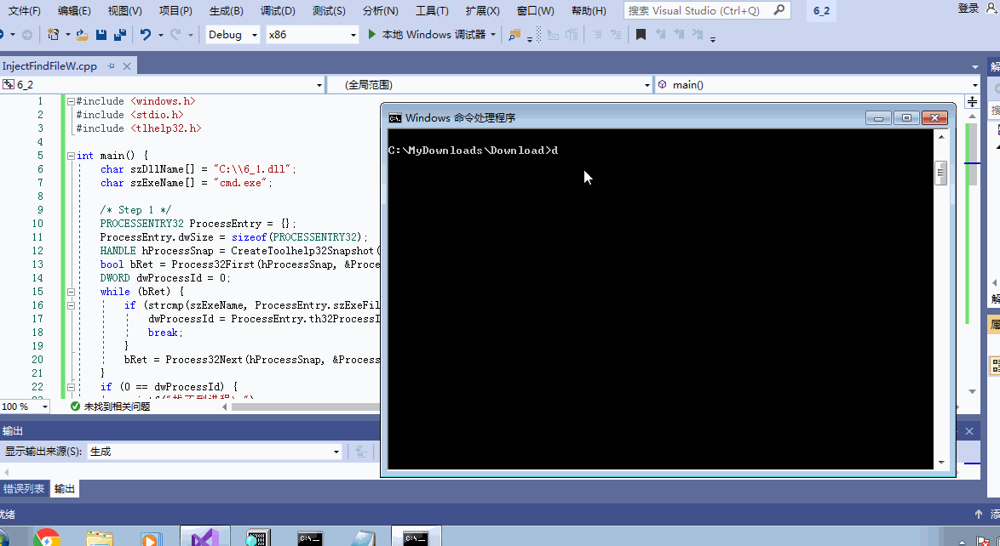

# 实验题目：
* 6：通过`API hook`的方法，使得`cmd`的`dir`命令看不到任意目录下的`hacker.exe `
* 首先需要分析`dir`是通过什么`API`的调用来遍历目录的，然后`hook`相关函数。

# 实验思路：
* 基本对第五题代码进行修改就可以完成。

* 需要知道`cmd.exe`在遍历目录的时候会调用什么`API`函数，然后`hook`相关函数。

* 查看`cmd.exe`的导入表[cmd_imp.txt](cmd_imp.txt)发现，可能的函数有以下三个。

> FindFirstFileW

> FindFirstFileExW

> FindNextFileW

* 通过`windbg`调试得知，执行遍历目录的命令`dir`指令时，程序会按顺序首先调用一次
`FindFirstFileExW`，然后调用若干次的`FindNextFileW`。

* 于是通过在`MSDN`上找到的函数原型，修改代码。

# 实验过程
* 构造`dll`文件。
    * 与[第五题第一部分](https://github.com/UP1998/Software-system-security/blob/lab/%E7%AC%AC%E4%BA%94%E9%A2%98/%E7%AC%AC%E4%BA%94%E9%A2%98%E7%AC%AC%E4%B8%80%E9%83%A8%E5%88%86/5_1.md)步骤一致，构建一个`windows桌面向导工程-dll类型`。
    * 该项目包含两个文件：[IAT.cpp](IAT.cpp)和[HookFindFileW.cpp](HookFindFileW.cpp)。
    * 仅生成，找到对应的[dll文件](6_1.dll)，放入便于找到的地址。
* 构造`Inject`文件
    * 与[第五题第一部分](https://github.com/UP1998/Software-system-security/blob/lab/%E7%AC%AC%E4%BA%94%E9%A2%98/%E7%AC%AC%E4%BA%94%E9%A2%98%E7%AC%AC%E4%B8%80%E9%83%A8%E5%88%86/5_1.md)步骤一致，构建一个`windows桌面向导工程-exe类型`。
    * 该项目包含一个文件：[InjectFindFileW.cpp](InjectFindFileW.cpp)。
    * 注意修改字符集。

# 实验录屏

# 参考资料
* [SecurityOfSoftwareAndSystem/6/6.md](https://github.com/TheMasterOfMagic/SecurityOfSoftwareAndSystem/blob/master/6/6.md)

* [FindFirstFileW function](https://docs.microsoft.com/en-us/windows/desktop/api/fileapi/nf-fileapi-findfirstfilew)

* [FindFirstFileExW function](https://docs.microsoft.com/en-us/windows/desktop/api/fileapi/nf-fileapi-findfirstfileexw)

* [FindNextFileW function](https://docs.microsoft.com/en-us/windows/desktop/api/fileapi/nf-fileapi-findnextfilew)